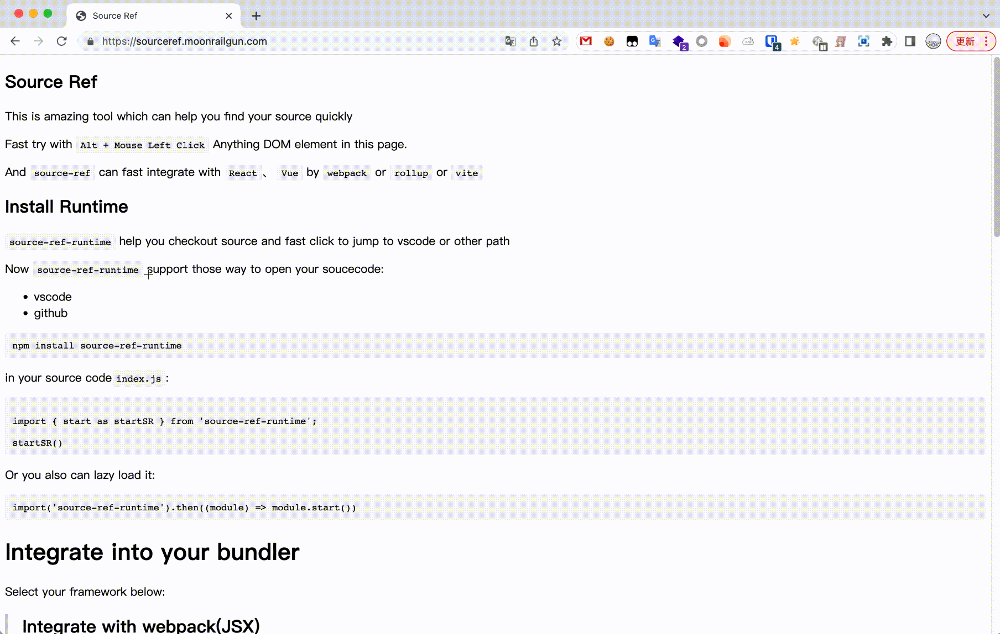
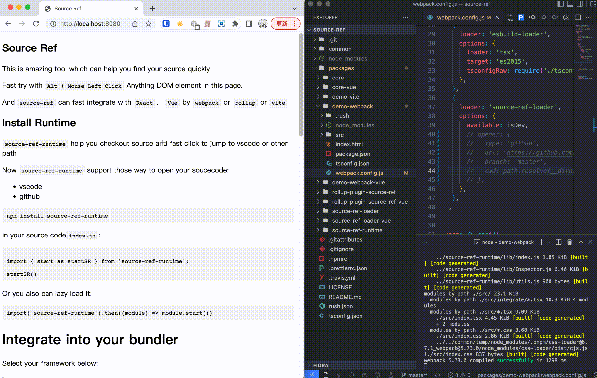

# source-ref
A tool for source code ref

More detail can checkout those page: [http://moonrailgun.com/posts/da6d1d53/](http://moonrailgun.com/posts/da6d1d53/)






## Develop

This repo is manager with `rush`


#### Install Dependency
```bash
rush update
```
